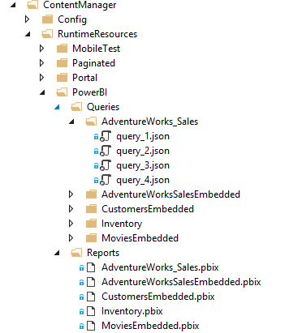

# How to onboard a new Paginated Reports Scenario

For this tutorial, we will learn how to add new reports to the **PowerBI** scenario 

* In the Visual Studio Solution you see a folder under RSLoad\ContentManager\RuntimeResources\PowerBI
* There are two more folders under PowerBI named Reports and Queries, it should look like this 

* Ensure the following conditions are met:
	* If you are adding an embedded model pbi report make sure you have "Embedded" in the report title. eg: MoviesEmbedded.pbix
    * If you are adding a pbi report with a live AS connection make sure your report uses one of the tabular databases on the SSRS-DATASOURCE server
    * The credentials of the data source are ASWindowsUser and ASWindowsPassword specified in RSTest.Common.ReportServer.dll.Config
	* Add the new report under the RSLoad\ContentManager\RuntimeResources\PowerBI\Reports folder eg: AdventureWorks_Sales.pbix
	* Add a new folder under queries with the same name of the report your just added. eg: RSLoad\ContentManager\RuntimeResources\PowerBI\Queries\AdventureWorks_Sales
	* On a working server make sure you render you report with fiddler running. 
	* Once the report renders go to fiddler and find the querydata requests for your pbi report. For each of the querydata requests right click -> Save -> Request -> requestbody into a .json file
	* Add all these query json files in the queries folder. eg:RSLoad\ContentManager\RuntimeResources\PowerBI\Queries\AdventureWorks_Sales
	* See snapshot below on how it looks at the end

	

